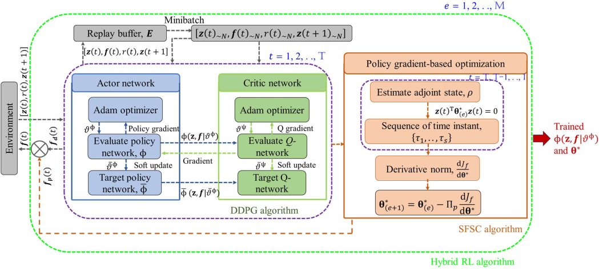
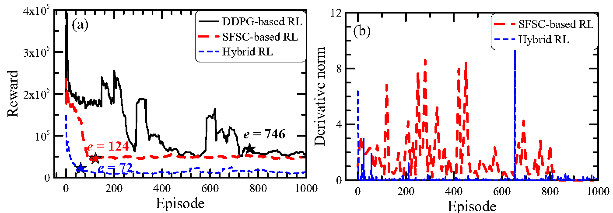

# Hybrid-Deep-Reinforcement-Learning-Policy
This repository contains the python codes of the paper 
  > + Panda, J., Chopra, M., Matsagar, V., & Chakraborty, S. (2024). Continuous Control of Structural Vibrations using Hybrid Deep Reinforcement Learning Policy. Expert Systems With Applications, Accepted, In press. [Article]

# Detailed learning sequence of the hybrid RL control policy.  

# Progress of reward function and derivative norm.

# Files
A short description of the files is provided below for ease of reading (check content file in each folder).
+ Folder: Case Study I: QCModel
  + `DDPG20_QC_state_Final.ipynb`: DDPG algorithm.
  + `DDPG20_PG_QC_state_Final`: Hybrid (DDPG + PG) algorithm.
+ Folder: Case Study II: 8-Story linear building
  + `DDPG20_JJP1_8Story_Final.ipynb`: DDPG algorithm.
  + `DDPG20_PG_JJP2_8Story_Final.ipynb`: Hybrid (DDPG + PG) algorithm.
+ Folder: Case Study II: 8-Story nonlinear building
  + `DDPG20_JJP1_8Story_Nonlinear.ipynb`: DDPG algorithm.
  + `DDPG20_PG_JJP2_8Story_Final_Nonlinear.ipynb`: Hybrid (DDPG + PG) algorithm.
+ Considered SAC ground motions to validate the robust performance of the trained controllers are placed in the folder 'GM' . In case, the location of the mentioned data is changed, the correct path should be given.

# Library support
The following packages are required to be installed to run the above codes:
  + [TensorFlow](https://www.tensorflow.org)
  + [Python Control Systems Library](https://python-control.readthedocs.io/en/latest/matlab.html)
  + [Fast Fourier Transform in Python](https://pythonnumericalmethods.berkeley.edu/notebooks/chapter24.04-FFT-in-Python.html)

# BibTex
If you use any part of our codes, please cite us at,

@article{Panda2023RL,
  title={Continuous Control of Structural Vibrations using Hybrid Deep Reinforcement Learning Policy},
  author={Panda, J. and Chopra, M. and Matsagar, V. and Chakraborty, S},
  journal={Expert Systems With Applications},
  volume={},
  pages={},
  year={2024},
  publisher={Elsevier}
}
